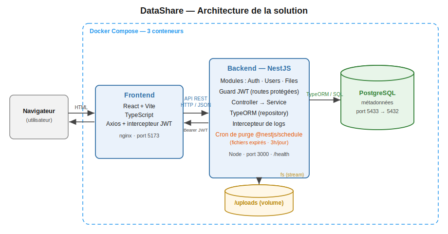
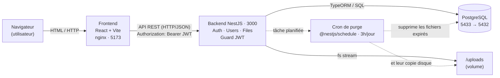

# Schéma d'architecture — DataShare

## Vue d'ensemble

L'application suit une architecture **3 couches**, entièrement conteneurisée avec Docker Compose :

| Couche | Technologie | Rôle |
|---|---|---|
| **Frontend** | React + Vite + TypeScript, servi par nginx (port 5173) | Interface dans le navigateur ; Axios avec un intercepteur qui ajoute le JWT |
| **Backend** | NestJS + TypeScript (port 3000) | API REST ; modules Auth / Users / Files ; Guard JWT ; logique métier ; **cron de purge** des fichiers expirés |
| **Base de données** | PostgreSQL (port 5433 → 5432) | Stocke les comptes et les **métadonnées** des fichiers |
| **Stockage fichiers** | Volume disque `/uploads` | Les fichiers eux-mêmes (pas en base) |

## Flux d'une requête

1. Le **navigateur** charge l'interface React servie par nginx.
2. Le **frontend** appelle le **backend** via une **API REST** (HTTP / JSON), en joignant le JWT dans l'en-tête `Authorization: Bearer`.
3. Le **backend** applique la logique (Guard → Controller → Service), puis lit/écrit les métadonnées dans **PostgreSQL** via **TypeORM**.
4. Les **fichiers** sont écrits/lus sur le disque (`/uploads`) en **streaming** (`fs.createReadStream`), jamais chargés entièrement en mémoire.
5. La réponse JSON (ou le flux du fichier) remonte jusqu'au navigateur.

**Tâche de fond (hors requête) :** un **cron** (`@nestjs/schedule`, tous les jours à 3 h) purge les fichiers expirés — suppression **du disque** (`/uploads`) **et de la base**. C'est ce mécanisme qui applique le cycle de vie « lien temporaire » (expiration 1 à 7 jours), au cœur du produit.

Le frontend ne touche **jamais** la base directement : le backend est l'unique intermédiaire, ce qui centralise la sécurité.

## Source du diagramme (Mermaid, éditable)

> Image vectorielle : [`architecture.svg`](architecture.svg). Source Mermaid ci-dessus (modifiable sur [mermaid.live](https://mermaid.live)).
