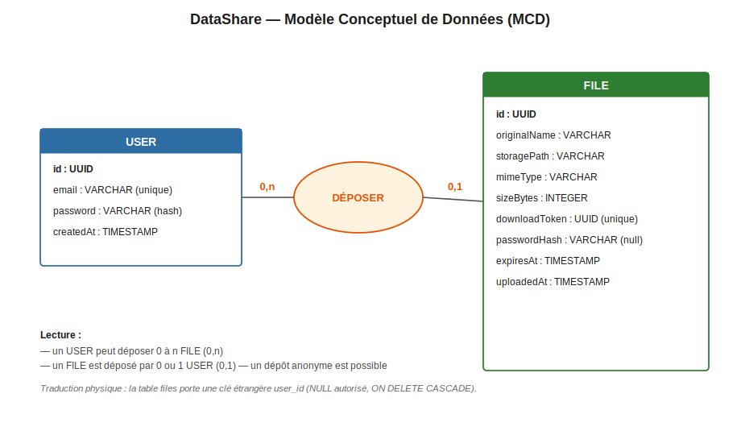
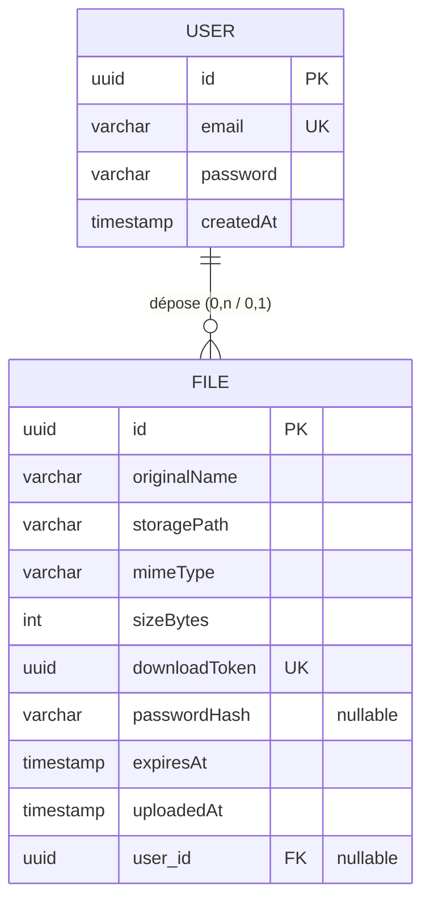

# Modèle Conceptuel de Données (MCD) — DataShare

## Lecture des cardinalités (Merise)

- Un **USER** peut déposer **0 à n** FILE → `(0,n)`
- Un **FILE** est déposé par **0 ou 1** USER → `(0,1)` (un dépôt anonyme est possible : `user_id` peut être NULL)

L'association **DÉPOSER** se traduit physiquement par une **clé étrangère `user_id`** dans la table `files` (NULL autorisé, `ON DELETE CASCADE` : supprimer un utilisateur supprime ses fichiers).

## Entités

### USER (table `users`)

| Attribut | Type | Contraintes |
|---|---|---|
| **id** | UUID | clé primaire |
| email | VARCHAR | **unique** |
| password | VARCHAR | haché (bcrypt), jamais en clair |
| createdAt | TIMESTAMP | auto |

### FILE (table `files`)

| Attribut | Type | Contraintes |
|---|---|---|
| **id** | UUID | clé primaire |
| originalName | VARCHAR | nom d'origine du fichier |
| storagePath | VARCHAR | chemin sur le disque |
| mimeType | VARCHAR | type MIME |
| sizeBytes | INTEGER | taille (max 1 Go) |
| downloadToken | UUID | **unique**, sert de lien de partage |
| passwordHash | VARCHAR | **nullable** (mot de passe optionnel, haché bcrypt) |
| expiresAt | TIMESTAMP | date d'expiration (1 à 7 jours) |
| uploadedAt | TIMESTAMP | auto |
| *user_id* | UUID | **clé étrangère** → `users.id`, nullable, CASCADE |

## Source du diagramme (Mermaid, éditable)

> Image vectorielle : [`mcd.svg`](mcd.svg). Source Mermaid ci-dessus (modifiable sur [mermaid.live](https://mermaid.live)).
